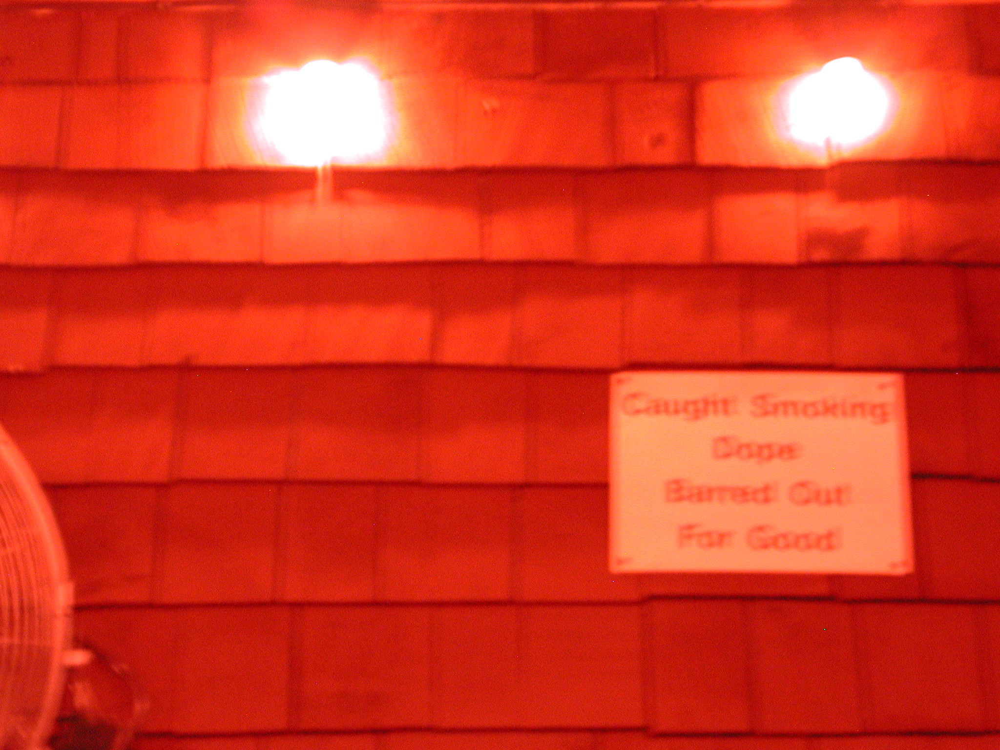

# Nikon COOLPIX 990

## Documentation/Drivers for the Nikon COOLPIX 990 digicam.

* [Nikon's COOLPIX 990 webpage](https://imaging.nikon.com/lineup/coolpix/others/990/index.htm)
* [Phil Askey's original review for *Digital Photography Review*](https://www.dpreview.com/reviews/nikoncp990)
* [Fran Blanche's extremely charming video](https://youtu.be/XJ_CcT1x9j4)

---

## Key Features

-   3x Zoom-Nikkor with 8-24mm coverage (equivalent to 38-115mm in the 35mm /[135/] format) to create clear, sharp images, plus 4x digital zoom
-   3.2 effective megapixels for high-definition 2,048 x 1,536-pixel images
-   Nikon's advanced image-processing algorithm has been further improved for superior picture quality
-   7-blade iris diaphragm for precise control over aperture settings
-   Exclusive 256-segment Matrix Metering and Matrix Auto White Balance for outstanding exposure and white balance control in every image
-   5-Area Multi AF
-   Shutter speed range from 1/1,000 to 8 seconds
-   Unique swivel design allows for a wider range of shooting angles
-   110,000-dot low temp polysilicon TFT LCD Monitor for easy viewing
-   Compatible with a wide range of converter lenses and accessories
-   Compatible with Fisheye Converter FC-E8, Wideangle Converter WC-E63 and Telephoto Converters TC-E2 / TC-E3ED
-   Compatible with Wideangle Converter WC-E68 (requires Lens Adapter UR-E7)
-   A successor of this camera is Nikon COOLPIX 995 (2001).

## Specifications

| Category                 | Data                                                         |
| :----------------------- | ------------------------------------------------------------ |
| Effective pixels         | 3.2 million                                                  |
| CCD                      | 3.34-million total pixels                                    |
| Lens / Digital zoom      | 3x Zoom-Nikkor, 8-24mm (35mm [135] format equivalent to 38-115mm); digital zoom up to 4x |
| Viewfinder               | Real image optical zoom viewfinder                           |
| LCD monitor              | 1.8-in. low-temp. polysilicon TFT LCD                        |
| Storage system           | RGB EXIF file (uncompressed TIFF or compressed JPEG)         |
| Storage media            | CompactFlash™ card Type I/II (Microdrive™ not compatible)    |
| Built-in Speedlight      | Sensor flash system/Guide number 9 / 30 (at ISO 100, m/ft.)  |
| Interface                | USB interface                                                |
| Power requirements       | 4 x 1.5V LR6 (alkaline AA-size [L40]) batteries; 1.5V FR6 lithium, 1.2V Ni-MH or 1.2V NiCd AA-size batteries can also be used; AC adapter EH-31 (optional) |
| Dimensions (WxDxH)       | Approx. 149 x 79 x 38mm (5.9 x 3.1 x 1.5 in.)                |
| Weight (without battery) | Approx. 390g (13.8 oz.)                                      |
| Accessories included*    | Lens cap, Neck strap, Video cable, 16MB CompactFlash™ Card, USB cable (UC-E1), Nikon View Ver.3 CD-ROM, Photoshop® 5.0 LE CD-ROM |

***

</img> </img> </img> </img> </img> </img> </img> </img> </img> </img> </img> </img> </img> </img> </img> </img> </img> </img> </img> </img> </img> </img> </img> </img> </img> </img> </img> </img> </img> </img> </img> </img> </img> </img> </img> </img> </img> </img> </img> </img> </img> </img> </img> </img> </img> </img> </img> </img> </img> </img> </img> </img> </img> </img> </img> </img> </img> </img> </img> </img> </img> </img> </img> </img> </img> </img> </img> </img> </img> </img> </img> </img> </img> </img> </img> </img> </img> </img> </img> </img> </img> </img> </img> </img> </img> </img> </img> </img> </img> </img> </img> </img> </img> </img> </img> </img> </img> </img> </img> </img> </img> </img> </img> </img> </img> </img> </img> </img> </img> </img> </img> </img> </img> </img> </img> </img> </img> </img> </img> </img> </img> </img> </img> </img> </img> </img> </img> </img> </img> </img> 